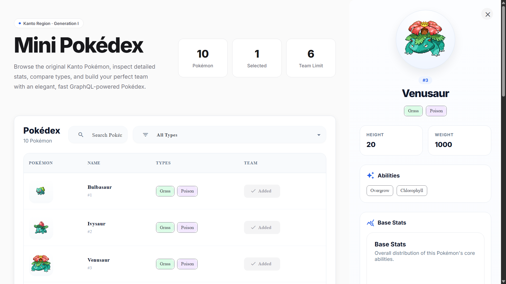
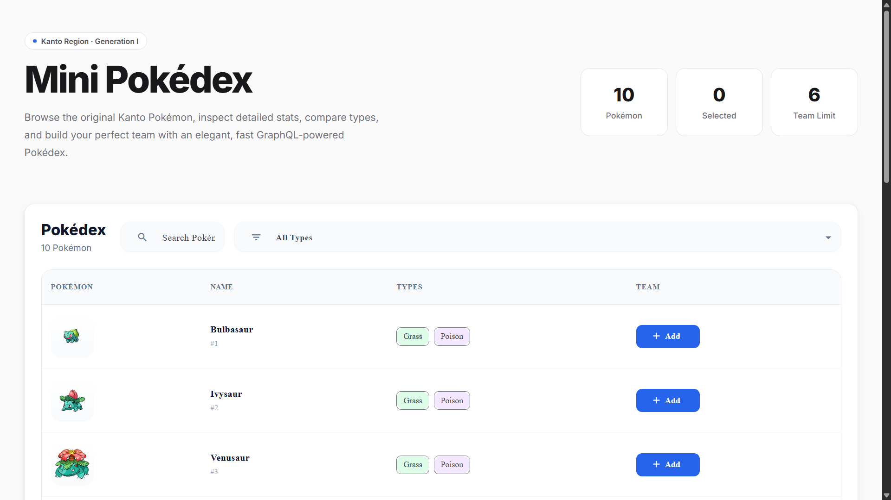
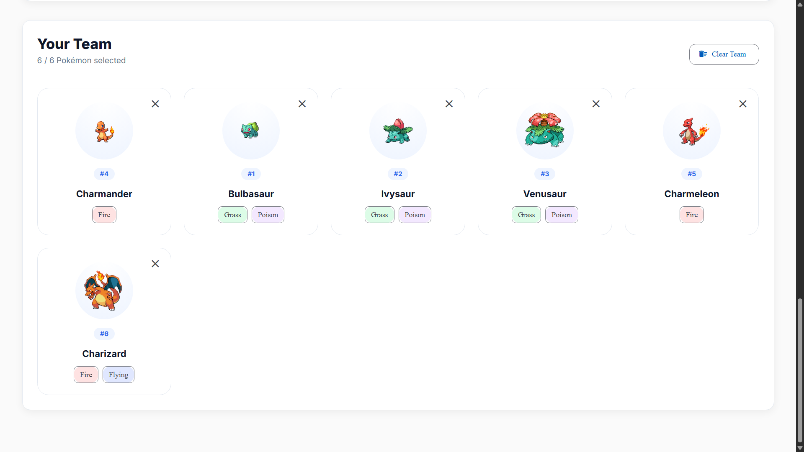

# ⚡ Mini Pokédex

A modern Pokédex built with **Angular 21**, **Angular Material**, **Apollo GraphQL**, **Angular Signals**, and **RxJS**.

🔗 **Live Demo:** https://mini-pokedex-git-main-hardikgaurrs-projects.vercel.app/

---

# 📸 Application Preview

## 🏠 Home



---

## 🔍 Pokémon Details



---

## 👥 Team Builder



---

# ✨ Features

## Pokédex

- Browse Pokémon from a GraphQL API
- Search Pokémon by name
- Sort Pokémon alphabetically
- Pagination support
- Responsive Angular Material table
- Pokémon details drawer
- Interactive radar chart for base stats

## Team Builder

- Build a team of up to six Pokémon
- Prevent duplicate selections
- Remove Pokémon individually
- Clear the entire team instantly

## State Management

- Angular Signals
- RxJS BehaviorSubject Store
- Reactive Selectors
- Shared Application State

## GraphQL

- Apollo Angular Client
- Query-based data fetching
- Automatic retry on transient failures
- Response caching using `shareReplay`

---

# 🚀 Tech Stack

- Angular 21
- TypeScript
- Angular Material
- Apollo Angular
- GraphQL
- RxJS
- Angular Signals
- Chart.js
- ng2-charts
- SCSS

---

# 📁 Project Structure

```text
src/
├── app/
│   ├── core/
│   ├── pokedex/
│   ├── shared/
│   └── teams/
```

---

# ⚙️ Installation

Clone the repository

```bash
git clone https://github.com/hardikgaurr/mini-pokedex.git
```

Navigate to the project

```bash
cd mini-pokedex
```

Install dependencies

```bash
npm install
```

Run the development server

```bash
ng serve
```

Open:

```text
http://localhost:4200
```

---

# 📦 Available Scripts

Start the development server

```bash
npm start
```

Run unit tests

```bash
npm test
```

Create a production build

```bash
npm run build
```

---

# 🏗️ Architecture

The application follows a modern feature-based Angular architecture.

- Standalone Components
- OnPush Change Detection
- Angular Signals for reactive UI state
- RxJS for asynchronous data flow
- Apollo GraphQL for API communication
- Angular Material UI Components
- Reusable shared components

---

# 🧠 State Management

Application state is managed using a centralized **BehaviorSubject** store.

Derived UI state is exposed using **Angular Signals** and **RxJS selectors** to keep components reactive and maintainable.

---

# 🛡️ Error Handling

- Automatic retry for transient GraphQL failures
- Centralized loading state management
- Graceful API error handling
- User-friendly feedback using Angular Material Snackbars

---

# 🧪 Testing

The project includes unit tests covering:

- Core services
- State management
- UI components

---

# 👨‍💻 Author

**Hardik Gaur**

- GitHub: https://github.com/hardikgaurr
- LinkedIn: https://www.linkedin.com/in/hardik-gaur/

---

# 📄 License

This project was created as part of a Frontend Engineering Assessment.